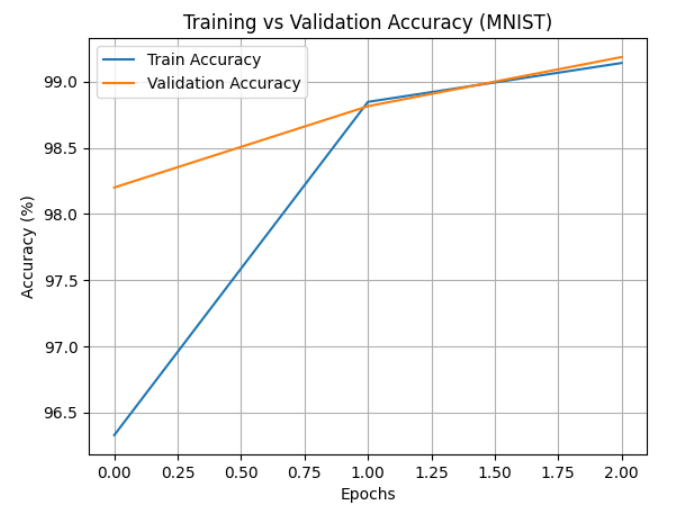
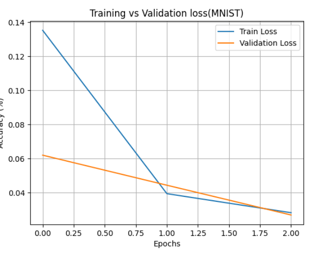
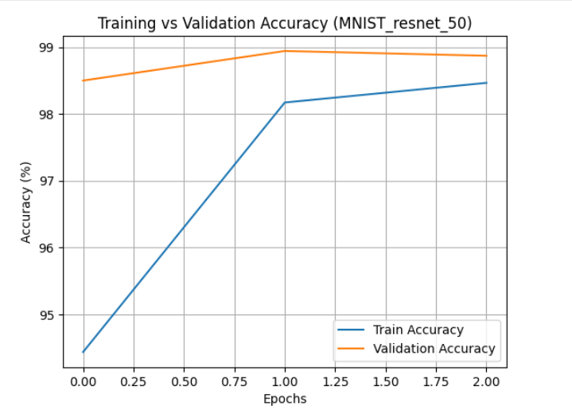
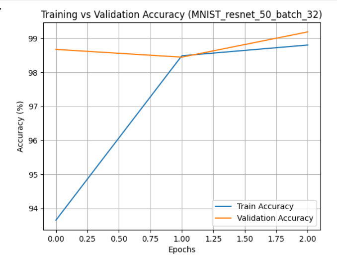
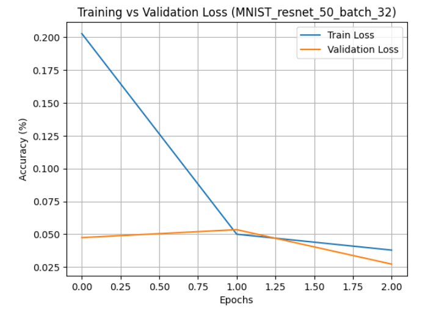

# ML-DLOPs Assignment–1  
**Deep Learning Operations: Experimental Analysis of CNNs and Classical Models**

**Name:** Akanksha Kapil  
**Roll Number:** M25CSA033  

**Colab Link** : https://colab.research.google.com/drive/1zLO5PKjbKKEfmrqx6WWslbfoP-YFyQjM?usp=sharing

---

## 📌 Overview
This repository contains the implementation, experiments, and analysis for **ML-DLOPs Assignment–1**.
The objective of this assignment is to study the impact of model architecture, optimization
strategy, and hardware resources on deep learning performance.

Experiments were conducted on:
- **MNIST**
- **FashionMNIST**

Using:
- **ResNet–18**
- **ResNet–50**
- **Support Vector Machines (SVMs)**

---

## 🧪 Q1(a): CNN Training from Scratch

### Experimental Setup
- Models: ResNet–18, ResNet–50 (pretrained = False)
- Data split: **70% Train – 10% Validation – 20% Test**
- Input size: **224 × 224**
- Optimizers: SGD, Adam
- Batch sizes: 16, 32
- Learning rates: 0.001, 0.0001
- Mixed Precision Training (AMP): Enabled
- `pin_memory=False` was tested initially and resulted in slower training  
  → Final experiments used **pin_memory=True**

---

### 📊 MNIST – Test Classification Accuracy (%)

| Batch Size | Optimizer | Learning Rate | ResNet–18 | ResNet–50 |
|----------|----------|---------------|----------|----------|
| 16 | SGD  | 0.001  | 98.71 | 98.10 |
| 16 | SGD  | 0.0001 | 95.37 | 96.15 |
| 16 | Adam | 0.001  | 97.79 | 98.10 |
| 16 | Adam | 0.0001 | 98.75 | 98.75 |
| 32 | SGD  | 0.001  | 98.85 | 98.73 |
| 32 | SGD  | 0.0001 | 94.55 | 90.45 |
| 32 | Adam | 0.001  | 98.80 | 97.57 |
| 32 | Adam | 0.0001 | 99.20 | 99.09 |

---

### 📊 FashionMNIST – Test Classification Accuracy (%)

| Batch Size | Optimizer | Learning Rate | ResNet–18 | ResNet–50 |
|----------|----------|---------------|----------|----------|
| 16 | SGD  | 0.001  | 99.08 | 88.50 |
| 16 | SGD  | 0.0001 | 97.02 | 77.30 |
| 16 | Adam | 0.001  | 98.97 | 89.55 |
| 16 | Adam | 0.0001 | 99.13 | 90.93 |
| 32 | SGD  | 0.001  | 98.55 | 88.40 |
| 32 | SGD  | 0.0001 | 95.45 | 71.69 |
| 32 | Adam | 0.001  | 91.89 | 90.26 |
| 32 | Adam | 0.0001 | 91.97 | 90.30 |

---

## 📈 Training and Validation Curves (MNIST)

### ResNet–18 (Batch Size = 16)

### ResNet–50 (Batch Size = 16)

### ResNet–50 (Batch Size = 32)

---

## 🧪 Q1(b): SVM Classification Results

| Dataset | Kernel | Test Accuracy (%) | Training Time (ms) |
|-------|--------|------------------|--------------------|
| MNIST | RBF | 97.92 | 204,594.84 |
| MNIST | Polynomial | 97.71 | 212,713.63 |
| FashionMNIST | RBF | 88.29 | 283,054.48 |
| FashionMNIST | Polynomial | 86.30 | 339,395.17 |

---

## ⚙️ Q2: CPU vs GPU Performance (FashionMNIST)

| Compute | Batch | Optimizer | LR | Acc–18 (%) | Acc–50 (%) | Time–18 (ms) | Time–50 (ms) | FLOPs–18 | FLOPs–50 |
|-------|------|----------|----|-----------|-----------|--------------|--------------|----------|----------|
| CPU | 16 | SGD  | 0.001 | 87.66 | 81.89 | 5,465,133.9 | 11,694,821.0 | 1.83×10⁹ | 4.14×10⁹ |
| CPU | 16 | Adam | 0.001 | 87.94 | 87.17 | 5,157,049.8 | 11,891,301.6 | 1.83×10⁹ | 4.14×10⁹ |
| GPU | 16 | SGD  | 0.001 | 88.60 | 84.97 | 110,018.2 | 260,172.1 | 1.83×10⁹ | 4.14×10⁹ |
| GPU | 16 | Adam | 0.001 | 86.00 | 83.85 | 108,764.6 | 272,061.4 | 1.83×10⁹ | 4.14×10⁹ |

---

## 🔍 Key Observations
- Adam optimizer with lower learning rate provided the most stable convergence
- Increasing model depth does not guarantee better performance when training from scratch
- ResNet–18 offers the best balance between accuracy and computational cost
- SVMs are accurate but computationally expensive
- GPU acceleration is essential for efficient deep learning training

---

## 📂 Repository Contents
- `assignment1.ipynb` – Executed experiments
- `M25CSA033_Akanksha_ass1.pdf` – Detailed LaTeX report
- `graphs/` – Training and validation plots
- `README.md` – Project documentation

---

## 🔗 Colab Link
📌 *((https://colab.research.google.com/drive/1zLO5PKjbKKEfmrqx6WWslbfoP-YFyQjM?usp=sharing))*

## Best Models Link (as i was not able to upload the models on github due to size issue)
- https://drive.google.com/drive/folders/1sovmtd1FlIFqHnMX4OLHWzZk0EZjrR30?usp=sharing

---

## ✅ Notes
- No pretrained weights were used
- All results are reproducible
- Experiments follow assignment guidelines

